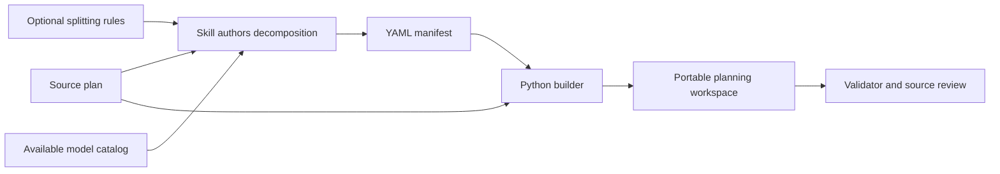

# WaveForge

**Turn a broad project plan into workstreams, dependency waves, and reviewable tasks.**

WaveForge is a Codex skill for preparing coordinated work across models or repositories. It preserves the original plan and produces a portable workspace with task documents, validation criteria, editable model routes, and ownership records.

The skill guides the decomposition; the Python scripts build and validate the workspace from an authored YAML manifest. The scripts do not call models or start workers.

## What you get

- Workstreams with their own goals, scope, validation, and evidence.
- Dependency-ordered waves containing bounded tasks with acceptance criteria.
- Source references that connect tasks to the original requirements.
- An editable model catalog and per-task model/effort policy.
- Spreadsheet-readable task and ownership records, initially unsigned.
- Optional splitting rules for workstream boundaries and size limits.
- Structural validation of dependencies, routing, preserved source, and live configuration.



## Install for Codex

Requirements: **Python 3.10 or newer**, **PyYAML**, and Git to clone this repository.

For a user-level installation, clone into your local skill directory.

**PowerShell (Windows):**

```powershell
New-Item -ItemType Directory -Force -Path "$HOME/.agents/skills" | Out-Null
git clone https://github.com/RamyHadad/waveforge.git "$HOME/.agents/skills/waveforge"
python -m pip install -r "$HOME/.agents/skills/waveforge/requirements.txt"
```

**Bash (macOS/Linux):**

```bash
mkdir -p "$HOME/.agents/skills"
git clone https://github.com/RamyHadad/waveforge.git "$HOME/.agents/skills/waveforge"
python3 -m pip install -r "$HOME/.agents/skills/waveforge/requirements.txt"
```

Alternatively, place the skill folder at `.agents/skills/waveforge/` inside the project that should use it. Keep `SKILL.md`, `agents/`, `references/`, and `scripts/` together. If it does not appear after installation, restart Codex. See the [official OpenAI skill documentation](https://learn.chatgpt.com/docs/build-skills) for discovery locations and invocation.

## Use the skill

In Codex CLI or the IDE extension, mention `$waveforge` in your prompt:

```text
Use $waveforge to decompose project-plan.md into a new planning workspace
at planning/release-1. Preserve source references, open decisions, and
approval gates. Use the models actually available in this environment.
Do not begin implementation.
```

For a configured split:

```text
Use $waveforge on project-plan.md, following splitting.yaml.
Create a new workspace at planning/release-2 and validate it.
```

WaveForge reads the plan, authors a manifest, builds the workspace, and checks its structure. A model catalog must reflect the target environment: model routes are planned assignments, not claims that work has begun.

## Try the runnable example

From a clone of this repository:

```bash
python -m pip install -r requirements.txt
python scripts/build_plan_workspace.py --source examples/source-plan.md --manifest examples/decomposition.yaml --split-config examples/splitting.yaml --out .demo-workspace
python scripts/validate_plan_workspace.py .demo-workspace
```

The example models are available in the environment used to author this example. Before using its routes for real work, replace them with IDs and supported efforts available in your own environment. Running the example does not contact those models.

The demo contains two workstreams and three tasks: define a note format, implement saving a note, and implement reopening it. The builder requires a **new output directory**. Choose a different `--out` path for another run.

## Generated workspace

```text
workspace/
  README.md
  source/
    ORIGINAL_PLAN.md
  configuration/
    manifest.yaml
    splitting.yaml
    project.yaml
    model_catalog.yaml
    model_policy.yaml
    task_register.csv
    ownership_signoff.csv
    OWNERSHIP_PROTOCOL.md
  plans/
    01_<workstream>/
      PLAN.md
      VALIDATION.md
      EVIDENCE.md
      waves/<wave>/
        WAVE.md
        tasks/<task>.md
```

| File | Purpose |
| --- | --- |
| `source/ORIGINAL_PLAN.md` | Preserved source plan, checked against its recorded hash |
| `configuration/manifest.yaml` | Initial authored decomposition |
| `configuration/splitting.yaml` | Rules used to shape the decomposition |
| `configuration/model_catalog.yaml` | Available model IDs and supported efforts |
| `configuration/model_policy.yaml` | Live planned model routes |
| `configuration/task_register.csv` | Live task status, dependencies, and owners |
| `configuration/ownership_signoff.csv` | Append-only record of actual claims, handoffs, and completion |
| `configuration/OWNERSHIP_PROTOCOL.md` | Coordination and evidence procedure |

After editing live routing or dependencies, update the corresponding task documents and run the validator. Changes to splitting rules do not rewrite tasks; generate a new workspace and review the differences. Preserve existing claims and evidence when migrating an active plan.

## Configuration and format

- [Manifest format and output contract](references/manifest-format.md)
- [Splitting configuration](references/splitting-configuration.md)
- [Complete skill instructions](SKILL.md)
- [Example source plan](examples/source-plan.md)
- [Example decomposition](examples/decomposition.yaml)

Without a splitting file, the skill chooses coherent workstreams from the plan. Optional rules can require workstreams, set numeric limits, and describe semantic boundaries. The scripts check numeric limits and required IDs; a model or reviewer checks whether the human-readable rules and source requirements are satisfied.

## Scope and limitations

WaveForge prepares plans and coordination records. It does not execute tasks, launch agents, approve work, or publish changes. It targets broad coordinated projects rather than ordinary single-task coding.

Validation checks structural consistency, including dependency cycles and model routes. It cannot prove that a decomposition faithfully covers the source plan; source review remains part of the skill workflow. The skill cannot switch the active chat model, and unknown model availability must be resolved before completing executable routes.

## Development

Run the existing smoke tests:

```bash
python -m unittest discover -s scripts -p "test_*.py" -v
```

GitHub Actions runs those tests and builds and validates the example on Python 3.10 and 3.14.

Contributions should describe the concrete problem, preserve the skill's planning boundary, and include relevant validation. See [CONTRIBUTING.md](CONTRIBUTING.md).

## Publish this repository

See [PUBLISHING.md](PUBLISHING.md) for the first upload to `RamyHadad/waveforge`, suggested repository metadata, and release steps.

## License

Licensed under the [MIT License](LICENSE). Copyright (c) 2026 Ramy Haddad.
