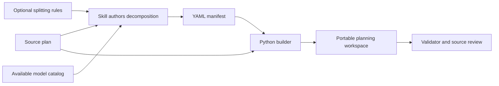

# WaveForge

**Turn a broad project plan into workstreams, dependency waves, and reviewable tasks.**

WaveForge is a Codex skill for preparing coordinated work across models or repositories. It preserves the original plan and produces a portable workspace with task documents, validation criteria, editable model routes, and ownership records.

The skill guides the decomposition; the Python scripts build and validate the workspace from an authored YAML manifest. The scripts do not call models or start workers.

## What you get

- Workstreams with their own goals, scope, validation, and evidence.
- Dependency-ordered waves containing bounded tasks with acceptance criteria.
- Source references that connect tasks to the original requirements.
- An editable model catalog and per-task model/effort policy.
- Spreadsheet-readable task and ownership records, initially unsigned.
- Optional splitting rules for workstream boundaries and size limits.
- Deterministic validation of dependencies, task states, worker claims, chronology, evidence files, routing, and preserved source.



## Install for Codex

Requirements: **Python 3.10 or newer**, **PyYAML**, and Git to clone this repository.

For a user-level installation, clone into your local skill directory.

**PowerShell (Windows):**

```powershell
New-Item -ItemType Directory -Force -Path "$HOME/.agents/skills" | Out-Null
git clone https://github.com/RamyHadad/waveforge.git "$HOME/.agents/skills/waveforge"
python -m pip install -r "$HOME/.agents/skills/waveforge/requirements.txt"
```

**Bash (macOS/Linux):**

```bash
mkdir -p "$HOME/.agents/skills"
git clone https://github.com/RamyHadad/waveforge.git "$HOME/.agents/skills/waveforge"
python3 -m pip install -r "$HOME/.agents/skills/waveforge/requirements.txt"
```

Alternatively, place the skill folder at `.agents/skills/waveforge/` inside the project that should use it. Keep `SKILL.md`, `agents/`, `references/`, and `scripts/` together. If it does not appear after installation, restart Codex. See the [official OpenAI skill documentation](https://learn.chatgpt.com/docs/build-skills) for discovery locations and invocation.

## Use the skill

In Codex CLI or the IDE extension, mention `$waveforge` in your prompt:

```text
Use $waveforge to decompose project-plan.md into a new planning workspace
at planning/release-1. Preserve source references, open decisions, and
approval gates. Use the models actually available in this environment.
Do not begin implementation.
```

For a configured split:

```text
Use $waveforge on project-plan.md, following splitting.yaml.
Create a new workspace at planning/release-2 and validate it.
```

WaveForge reads the plan, authors a manifest, builds the workspace, and checks its structure. A model catalog must reflect the target environment: model routes are planned assignments, not claims that work has begun.

### Choose who assigns models and effort

You can set each task's route yourself, let the planning agent choose, or combine the two. A route has a **model ID** and an **effort level** (sometimes called intensity). The planning agent uses only the models and effort levels actually available in your environment. Manual choices take precedence; unavailable or unsupported choices must be surfaced for correction.

To let the agent select routes per task, use a prompt such as:

```text
Use $waveforge to plan project-plan.md. Use models and supported efforts
available in this environment. Select a suitable model and effort for each
task based on its scope, risk, and validation needs. Explain stronger routes
in the task plan. Build a new workspace at planning/release-1 and validate it.
Do not implement the tasks.
```

To select routes manually, provide the exact assignments when you request the plan:

```text
Use $waveforge to plan examples/source-plan.md. Use models available here.
Route the note-format task to gpt-6-luna at medium effort and the save-note
task to gpt-6-sol at high effort. Choose routes for any other tasks.
Build a new workspace at planning/release-1 and validate it.
```

Before task IDs exist, identify tasks by outcome or provide routing preferences. Once task IDs exist, you can name them directly. After generation, you can manually change routes in `configuration/model_policy.yaml` as shown below. The routes record plans for implementation; they do not start workers.

## Try the runnable example

From a clone of this repository:

```bash
python -m pip install -r requirements.txt
python scripts/build_plan_workspace.py --source examples/source-plan.md --manifest examples/decomposition.yaml --split-config examples/splitting.yaml --out .demo-workspace
python scripts/validate_plan_workspace.py .demo-workspace
```

The example models are available in the environment used to author this example. Before using its routes for real work, replace them with IDs and supported efforts available in your own environment. Running the example does not contact those models.

The demo contains two workstreams and three tasks: define a note format with `gpt-6-luna` at medium effort, save a note with `gpt-6-sol` at medium effort, then reopen it with `gpt-6-sol` at high effort. The high route illustrates a manual intensity choice. These IDs were available when the example was written; check your own environment before using the routes. The builder requires a **new output directory**. Choose a different `--out` path for another run.

### Inspect a real-project case study

The [WaveForge v0.1.0 case study](examples/real-project/README.md) includes a redacted release-preparation request, three workstreams, nine bounded tasks, model/effort routes, and a checked-in generated workspace. It links to the actual implementation, CI, and release. The decomposition was created retrospectively; its unsigned ledger and planned task states are not historical execution records.

```text
python scripts/validate_plan_workspace.py examples/real-project/workspace
```

## Generated workspace

```text
workspace/
  README.md
  source/
    ORIGINAL_PLAN.md
  configuration/
    manifest.yaml
    splitting.yaml
    project.yaml
    model_catalog.yaml
    model_policy.yaml
    task_register.csv
    ownership_signoff.csv
    OWNERSHIP_PROTOCOL.md
  plans/
    01_<workstream>/
      PLAN.md
      VALIDATION.md
      EVIDENCE.md
      waves/<wave>/
        WAVE.md
        tasks/<task>.md
```

| File | Purpose |
| --- | --- |
| `source/ORIGINAL_PLAN.md` | Preserved source plan, checked against its recorded hash |
| `configuration/manifest.yaml` | Initial authored decomposition |
| `configuration/splitting.yaml` | Rules used to shape the decomposition |
| `configuration/model_catalog.yaml` | Available model IDs and supported efforts |
| `configuration/model_policy.yaml` | Live planned model routes |
| `configuration/task_register.csv` | Live task status, dependencies, and owners |
| `configuration/ownership_signoff.csv` | Append-only record of actual claims, handoffs, and completion |
| `configuration/OWNERSHIP_PROTOCOL.md` | Coordination and evidence procedure |

After editing live routing or dependencies, update the corresponding task documents and run the validator. Changes to splitting rules do not rewrite tasks; generate a new workspace and review the differences. Preserve existing claims and evidence when migrating an active plan.

### Edit the model YAML

The model configuration is generated with each workspace and can be edited as the project changes. `configuration/model_catalog.yaml` lists model IDs **available in your environment** and their supported effort levels. In the included example it starts as:

```yaml
version: 1
models:
  gpt-6-luna:
    role: focused implementation
    supported_efforts: [medium]
  gpt-6-sol:
    role: implementation and contract review
    supported_efforts: [medium, high]
```

To change a planned route, edit `configuration/model_policy.yaml`. For example, manually increasing `T-002` from medium to high effort changes its entry to:

```yaml
tasks:
  T-002:
    model: gpt-6-sol
    effort: high
    escalation_eligible: false
```

Keep the rest of `model_policy.yaml`, including its `version`, `escalation`, and other task entries. Then update the matching line in `plans/02_storage/waves/wave-1/tasks/T-002.md`:

```text
Starting model: `gpt-6-sol` · Effort: `high`.
```

Run `python scripts/validate_plan_workspace.py <workspace>` to confirm the route uses a cataloged model and supported effort and matches the task document. If you add a model, enter its real callable ID and supported efforts in the catalog first. The original `manifest.yaml` remains a record of the initial route.

These YAML files are a **planning policy**, not an automatic model selector. A coordinator or worker reads the current route when assigning work. Changing YAML alone does not launch a model, move an active chat to another model, or record an ownership claim. See the generated `configuration/OWNERSHIP_PROTOCOL.md` for claim and escalation rules.

### Implement a wave using its model routes

After generating a workspace and saving its routes, give the coordinator this implementation prompt:

```text
Implement Wave 3 using the saved model routing policy. Dispatch each ready
task to a worker with its configured model and reasoning effort, following
the task protocol and dependencies.
```

Replace `Wave 3` with the wave you want to implement. If several workstreams use the same wave name, specify the workstream and workspace path. The coordinator reads the saved policy and dispatches each ready task with its own model and effort; this applies equally to manually selected routes and routes chosen by the planning agent. Tasks with unmet dependencies wait until those dependencies are completed. Worker dispatch must be available in the execution environment and support the configured models and efforts. Follow the generated ownership protocol to record actual workers, validation, and completion evidence.

For the included example, the `foundation` workstream's first wave contains `T-001` routed to `gpt-6-luna` at medium effort. The `storage` workstream's first wave contains `T-002` routed to `gpt-6-sol` at medium effort and depends on `T-001`; its second wave routes `T-003` to `gpt-6-sol` at high effort. A more explicit prompt for that example is:

```text
Implement the first wave in each workstream of .demo-workspace, in dependency
order. Read configuration/model_catalog.yaml, model_policy.yaml,
task_register.csv, and OWNERSHIP_PROTOCOL.md, then read the wave and task files.
Start with T-001 using its planned model and effort; after its acceptance and
dependencies are verified, proceed to T-002 using its own route.

Before each task, check that the routed model is actually available here.
If you can assign work to that model, record the real worker's claim and update
the register as the ownership protocol requires. Run each task's validation,
record actual evidence and completion, and validate the planning workspace.
If the required model or assignment capability is unavailable, stop before
claiming that task and report the limitation. Do not mark unperformed work done.
```

Replace `.demo-workspace` with your generated workspace path. The coordinator needs a way to start workers with the selected models. In a single Codex chat without that capability, select the planned model in your interface and implement one task at a time. There is no WaveForge command that automatically executes a wave or switches models; `build_plan_workspace.py` and `validate_plan_workspace.py` only build and check the plan. Follow the generated ownership protocol when recording actual claims and results.

## Configuration and format

- [Manifest format and output contract](references/manifest-format.md)
- [Splitting configuration](references/splitting-configuration.md)
- [Task states, ownership, and evidence](references/ownership-and-evidence.md)
- [Complete skill instructions](SKILL.md)
- [Example source plan](examples/source-plan.md)
- [Example decomposition](examples/decomposition.yaml)
- [Real-project case study](examples/real-project/README.md)

Without a splitting file, the skill chooses coherent workstreams from the plan. Optional rules can require workstreams, set numeric limits, and describe semantic boundaries. The scripts check numeric limits and required IDs; a model or reviewer checks whether the human-readable rules and source requirements are satisfied.

## Scope and limitations

WaveForge prepares plans and coordination records. It does not execute tasks, launch agents, approve work, or publish changes. It targets broad coordinated projects rather than ordinary single-task coding.

Validation checks structural consistency, including dependency cycles and model routes. `READY`, `IN_PROGRESS`, and `DONE` require completed dependencies; in-progress tasks need matching worker claims, and done tasks need valid completion records and evidence. Ledger event chronology and local evidence files are checked. Free-text evidence and external links remain supported, but the validator cannot prove acceptance outcomes or source-plan coverage; those need review. The skill cannot switch the active chat model, and unknown model availability must be resolved before completing executable routes.

## Development

Run the complete test suite:

```bash
python -m unittest discover -s scripts -p "test_*.py" -v
```

GitHub Actions runs those tests, builds and validates both examples, and validates the checked-in case-study workspace on Python 3.10 and 3.14.

Contributions should describe the concrete problem, preserve the skill's planning boundary, and include relevant validation. See [CONTRIBUTING.md](CONTRIBUTING.md).

## Releases

See [CHANGELOG.md](CHANGELOG.md) for the `v0.1.0` capabilities and compatibility notes, and [RELEASING.md](RELEASING.md) for checks, tags, and GitHub release publication. Release versions are independent of YAML schema `version: 1`.

## License

Licensed under the [MIT License](LICENSE). Copyright (c) 2026 Ramy Haddad.
