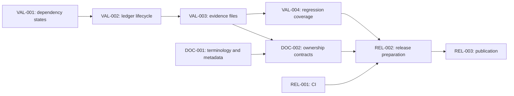

# Case study: preparing WaveForge v0.1.0

This example uses a real completed project: WaveForge's first release and
validator hardening. It contains a redacted source request, a decomposition,
and a generated workspace you can inspect without running the builder.

**This is a retrospective planning example.** The release work was completed
before this workspace was generated. The task IDs, waves, and model routes
were authored for this case study; they are not a recovered execution log.
The task register remains `PLANNED` and the ownership ledger remains unsigned.
Published outcomes are linked separately below.

Use this workspace for inspection and validation. The `v0.1.0` release already
exists; do not execute its publication task against that existing release.
To reuse the shape for new work, adapt the source and version, author a fresh
manifest, and generate a new workspace.

## From request to workspace

The [redacted source](source-plan.md) combines release polish, documentation,
CI, and validator correctness requirements in one request. The
[decomposition](decomposition.yaml) turns it into three workstreams and nine
bounded tasks:

| Workstream | Tasks | Purpose |
| --- | --- | --- |
| Validator correctness | `VAL-001`–`VAL-004` | Task states, ownership history, evidence, and regression coverage |
| Contracts and documentation | `DOC-001`–`DOC-002` | Metadata, terminology, and agreement between rules and docs |
| Release delivery | `REL-001`–`REL-003` | CI updates, release preparation, and gated publication |



The release depends on validation and reviewed contracts. Work touching the
same validator file is placed in consecutive waves. Independent metadata and
CI changes can be planned alongside it. Each task has acceptance, validation,
expected evidence, file scope, and references to stable requirement IDs.

The catalog illustrates Luna/medium for bounded metadata or CI edits and
Sol/medium or Sol/high for contract, state, and evidence work. These are
proposed routes using models available when this example was authored. They
do not establish which models performed the original release. Verify your
own environment and change the routes before using the plan for actual work.

## Inspect the generated artifacts

- [Workspace index](workspace/README.md)
- [Preserved redacted source](workspace/source/ORIGINAL_PLAN.md)
- [Live model policy](workspace/configuration/model_policy.yaml)
- [Task register](workspace/configuration/task_register.csv)
- [Unsigned ownership ledger](workspace/configuration/ownership_signoff.csv)
- [Ownership protocol](workspace/configuration/OWNERSHIP_PROTOCOL.md)
- [A validator task](workspace/plans/01_validator/waves/evidence/tasks/VAL-003.md)
- [The publication gate](workspace/plans/03_delivery/waves/publication/tasks/REL-003.md)

Validate the checked-in workspace from the repository root:

```text
python scripts/validate_plan_workspace.py examples/real-project/workspace
```

Rebuild it into a fresh directory:

```text
python scripts/build_plan_workspace.py --source examples/real-project/source-plan.md --manifest examples/real-project/decomposition.yaml --out .demo-workspace-real-project
python scripts/validate_plan_workspace.py .demo-workspace-real-project
```

Generation records its own timestamp, so a rebuild need not be byte-identical.
The preserved source hash, requirements, task IDs, dependencies, and routes
are the inspectable planning contract.

## Actual published outcomes

The original work is visible in [release commit 2b36bc8](https://github.com/RamyHadad/waveforge/commit/2b36bc871f772852c2b53e216ff6d823210b7fe4),
the [successful CI run](https://github.com/RamyHadad/waveforge/actions/runs/37060845454),
and [v0.1.0](https://github.com/RamyHadad/waveforge/releases/tag/v0.1.0).
The implementation added coordination invariants and expanded the unittest
suite to 43 tests. CI passed on Python 3.10 and 3.14. These project-level
outcomes are not retroactively assigned to this example's task IDs.

The example demonstrates traceability, bounded task descriptions, routing,
and explicit validation/publication dependencies. It does not measure time
saved or demonstrate that this decomposition directed the historical work.

## Redaction and provenance

The source was normalized from the maintainer's release-preparation request.
Machine-specific paths, attachment IDs, personal contact details, and chat
transcript details are omitted. Stable requirement IDs refer to the redacted
source, which is the sole source plan preserved and hashed in this workspace.
Public repository-relative file paths and published commit, release, and CI
links are retained so readers can verify the outcome.

No private project files or Wave 3 screenshot records were included. No worker
identities, claims, signatures, or historical per-task timestamps were
invented. For a case study of an actual dispatched wave, retain its original
redacted ledger and evidence alongside the original plan instead.
